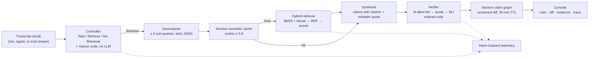

# Prelude

[](https://github.com/iakshkhurana/prism/actions/workflows/ci.yml) [](https://github.com/iakshkhurana/prism/releases)

**Streaming, verifiable, refine-not-restart RAG for live voice support** — retrieval fires while the caller is still speaking, one utterance fans out into parallel sub-questions, a late detail refines the answer instead of restarting it, and every claim carries a `[Doc_ID §Section]` citation with a verbatim quote or is labelled *not in the corpus*.

> A conventional RAG assistant waits for the question to end, then searches. Prelude decides per transcript chunk — *Wait / Retrieve / No-Retrieval*, with a reason code — fires at the first stable anchor and clause boundary, and has a cited answer forming on the agent's screen before the sentence is over. A verifier that can only subtract makes fabricated citations zero by construction.

Built for Samsung PRISM Gen AI Hackathon 3.0, Theme 4, and positioned as **Live Agent Assist**: the control-room-style console shows the agent a calm, cited answer and shows the judge the engine deciding, on one screen.

## Demo video

[Watch the 5-minute demo](https://youtu.be/jLJLWHfmwJc)

## Why it's different

Answer quality is not the hard part of live assist; *timing* and *trust* are. Prelude treats both as measured properties, not promises. A **rule-based controller** (no LLM in the loop, ~25 ms) reads entity anchors, embedding drift, clause boundaries and content tokens per chunk and fires early; the gap between where it fired and the offline-labelled safe point is scored as **headroom**. A **multi-intent decomposer** splits one utterance into up to four sub-queries. **Hybrid retrieval** (BM25 + dense, reciprocal-rank fusion, cross-encoder rerank) returns hits that carry their own provenance. **Claim-based synthesis** emits claims with citations and verbatim quotes, never prose. A **subtractive verifier** — id allow-list → verbatim quote match → NLI entailment — can reject a claim but never edit, invent or promote one. A **session claim graph** versions every claim so a late detail updates only the affected ones, and *"say that again, shorter"* re-renders with zero retrievals.

The model never gets the last word. If the corpus does not cover a sub-question, the answer says so.

## Results (through the full stack, no API key, no model download)

Measured by `make eval` on 2026-09-29 against 7 labelled streams in `evaluation/streams/`, driven through nginx exactly as the dashboard is. Every number below is generated from that run; CI fails if this table drifts from `evaluation/results/scorecard.md`.

| Gate | Description | Internal target | Result |
|---|---|---|---|
| G1 | Reproducibility | 90 | 100.0 ✔ |
| G2 | Early retrieval | ≥ 80% | 100.0 ✔ |
| G3 | Multi-intent handling | ≥ 70% | 100.0 ✔ |
| G4 | Citation support, zero fabricated IDs | ≥ 85%, 0 | 100.0 ✔ |
| G5 | Verified session continuity | — | 100.0 ✔ |
| G6 | Trace coverage | 100% | 100.0 ✔ |

Mean headroom **0.14 chunks** (the controller fired at or just after the safe point on every stream, never before). Off-corpus questions answered anyway: **0.0%**. The injected adversarial chunk, even when legitimately retrieved, never reaches *verified*. Per-stage latencies, ablations and limitations: [evaluation/Evaluation_Benchmarks.md](evaluation/Evaluation_Benchmarks.md).

These are mechanism-coverage numbers on one stream per category, not a generalization claim.

## How a spoken chunk becomes a cited claim



A real speech pipeline plugs in at the same seam the console's mic uses — `POST /turn/{token}` with a chunk index and text. Nothing downstream cares where the chunk came from.

## What it is not

Not a chatbot: it will not answer from general knowledge, only from the mounted corpus, and it says *not in the corpus* rather than guessing. Not a speech recognizer (the browser's Web Speech API or your own ASR feeds it). Not a document management system: ingestion is Markdown with a frontmatter header, one chunk per section. The logistic-regression controller, PDF/DOCX ingestion, RAGAS scoring and a server-push event stream are designed in the ADRs and deliberately not built for this version.

## Architecture

- **`packages/core`** — pure, dependency-free logic shared by every service: schemas, the controller rule policy, reciprocal-rank fusion, the claim graph, the hash chain. No I/O, fully unit-tested.
- **`gateway`** — the only stateful service. Per-session controllers, the orchestrator that sequences decompose → retrieve → synthesize → verify, the session semantic cache, the Redis-backed claim store, the verifier, hash-chained JSONL telemetry, HMAC session tokens and PII redaction. Every `/turn` response includes this turn's evidence with full provenance.
- **`ml-service`** — embeddings, per-chunk features, cross-encoder rerank, NLI. `ML_BACKEND=hash` (default) uses dependency-free fallbacks so the image builds in seconds; `ML_BACKEND=transformer` uses bge-small, MiniLM and a transformer NLI checker.
- **`vector-service`** — section-aware chunking (`[Doc_ID §2.1]` ids come from document structure, so they survive edits), BM25 + Qdrant dense search, RRF, rerank. Ingests the corpus at startup; superseded document versions are excluded from the index.
- **`ai-service`** — the only service that talks to OpenAI. `AI_MODE=live | record | offline | replay`: `offline` is a deterministic key-free provider, `replay` serves committed trajectories and fails loudly on a miss. Structured-output parsing drops anything that is not a claim with a citation and a quote. Per-session cost meter with a ceiling.
- **`web`** — React 18 + Vite + TypeScript, no component library. `/` is the front page, `/console` the live console: transcript band with headroom ruler and decision strip, claim diff with verifier trail, evidence drawer with BM25/dense/RRF/rerank provenance, evidence graph, sub-query fan-out with cache hits, latency waterfall, telemetry pane with chain verification and JSONL export, guided **Tour** of the seven demo moments, mic mode with clause-sized chunking, eight appearance themes.
- **`mcp-adapter`** — Prelude as MCP tools over the gateway API for voice-agent stacks; stateless, imported by nothing else.
- **Edge and data** — nginx (rate limit, 2 MB body cap) in front of the gateway; Qdrant for dense vectors; Redis for session state with a 30-minute TTL keyed by session id only.

## Project layout

```
packages/core/        pure logic: schemas, controller policy, fusion, claim graph, hash chain
services/gateway/     controller, orchestrator, semantic cache, claims, verifier, telemetry, security
services/ml-service/  embed, features, rerank, nli (hash | transformer)
services/vector-service/  ingest, chunking, BM25 + dense search
services/ai-service/  OpenAI / offline / replay providers, decompose, synthesize, cost
services/web/         front page + console (React, Vite, TS)
services/mcp-adapter/ MCP tool surface
services/eval-runner/ runs the harness against the stack
evaluation/           labelled streams, scoring harness, results, benchmark report
corpus/               demo corpus (Samsung support KB) — mount your own here
prompts/              versioned decompose / synthesize prompts
schemas/              JSON Schemas for events, telemetry, output records
trajectories/         recorded provider responses for replay
documentation/        architecture brief, ADRs 0001–0008, security, telemetry, AI disclosure
deploy/nginx/         edge config
scripts/              CI checks (hardcode, README/scorecard sync)
docker-compose.yml    the whole stack
```

## Running it

**Prerequisites:** Docker with Compose v2. Nothing else — the default profile needs no API key and downloads no model.

```bash
cp .env.example .env
docker compose up --build -d
```

Open **http://localhost** (front page) or **http://localhost/console** and press **Tour**. The corpus is ingested when `vector-service` starts. A cold build takes about a minute; a warm start, seconds.

Switch to the real models and the live LLM:

```bash
# .env: AI_MODE=live, OPENAI_API_KEY=..., DECOMPOSE_MODEL / SYNTHESIZE_MODEL
docker compose up -d --no-deps ai-service
ML_BACKEND=transformer docker compose up --build -d ml-service   # bge-small + MiniLM + NLI, first build pulls the models
```

Bring your own corpus: drop Markdown files with a frontmatter header (`doc_id`, `title`, `version`, `effective_date`, `status`) into `corpus/` and `docker compose restart vector-service`.

Drive it without the UI:

```bash
token=$(curl -s -X POST http://localhost/api/session/start | jq -r .token)
curl -s -X POST http://localhost/api/turn/$token -H 'Content-Type: application/json' \
  -d '{"chunk_index": 0, "text": "My Galaxy phone will not power on at all, even after charging it."}' | jq
```

Full route list, configuration reference and deployment notes: [REPRODUCTION.md](REPRODUCTION.md).

## Tests and evaluation

```bash
make test           # unit tests: packages/core, every service, mcp-adapter, harness
make lint           # no eval-stream content under services/ (derived from the streams themselves)
make eval           # G1–G6 through the running stack, writes evaluation/results/scorecard.md
make eval MODE=live
make eval-ablation  # dense-only retrieval, writes scorecard_dense_only.md beside the main scorecard
cd services/web && npm test
```

CI on every push: per-service unit tests, web tests and build, JSON Schema validation, the hardcode check, README/scorecard sync, a Trivy scan, and a compose-smoke job that builds the whole stack and drives one real turn through nginx. Merges to `main` publish images to GHCR.

## Documentation

[Architecture brief](documentation/Architecture_Brief.md) · [ADRs](documentation/adr/) · [Benchmarks](evaluation/Evaluation_Benchmarks.md) · [Evaluation design](evaluation/README.md) · [Security threat model](documentation/SECURITY.md) · [Telemetry](documentation/TELEMETRY.md) · [Positioning](documentation/POSITIONING.md) · [Console design record](services/web/DESIGN.md) · [Reproduction](REPRODUCTION.md)

AI usage is disclosed feature by feature in [documentation/AI_Disclosure.pdf](documentation/AI_Disclosure.pdf). `CLAUDE.md` at the repo root holds the architectural rules and map for anyone, human or AI, working in this codebase.
